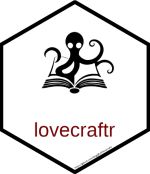

# lovecraftr 

[](https://cran.r-project.org/package=lovecraftr)
[](https://github.com/SergejRuff/lovecraftr/actions/workflows/R-CMD-check.yaml)
[](https://cran.r-project.org/package=lovecraftr)


The **lovecraftr** package offers a collection of H.P. Lovecraft's most renowned stories,
formatted for easy access and text analysis. This package is intended for literary study,
text analysis, and exploration of Lovecraft’s unique themes and style within the horror genre.


## Installation

To install the CRAN version:

``` r

install.packages("lovecraftr")

```

To install the development version of **lovecraftr** from GitHub, follow these steps:

``` r
### First install the "devtools" package

install.packages("devtools")

### Then install the lovecraftr package

devtools::install_github("SergejRuff/lovecraftr")


```

## Usage

The `unearth_lovecraftian_tales()` function provides a dataframe containing all available Lovecraft story titles along with their corresponding abbreviations. 
By default, calling `unearth_lovecraftian_tales()` returns the complete list of titles and abbreviations within the package. 
To retrieve the text of a specific story, you can provide either the full title, e.g., `unearth_lovecraftian_tales("At the Mountains of Madness")`, or the abbreviation, e.g., `unearth_lovecraftian_tales("MM")`.

The `fetch_lovecraft()` function downloads H.P. Lovecraft's writings directly from the H.P. Lovecraft Archive (https://www.hplovecraft.com/), providing users with easy access to all of his works, including those not available through the `unearth_lovecraftian_tales()` function.

List of Stories Included in the **lovecraftr** Package:

- *At the Mountains of Madness* (abbreviation: "MM")
- *Azathoth* (abbreviation: "AZA")
- *Beyond the Wall of Sleep* (abbreviation: "BWS")
- *Celephais* (abbreviation: "C")
- *Cool Air* (abbreviation: "air")
- *Dagon* (abbreviation: "D")
- *He* (abbreviation: "HE")
- *Herbert West—Reanimator* (abbreviation: "HWR")
- *The Alchemist* (abbreviation: "ALC")
- *The Beast in the Cave* (abbreviation: "BIC")
- *The Book* (abbreviation: "book")
- *The Call of Cthulhu* (abbreviation: "CC")
- *The Case of Charles Dexter Ward* (abbreviation: "CDW")
- *The Cats of Ulthar* (abbreviation: "cat")
- *The Colour Out of Space* (abbreviation: "CS")
- *The Descendant* (abbreviation: "DE")
- *The Doom That Came to Sarnath* (abbreviation: "DS")
- *The Dreams in the Witch House* (abbreviation: "DWH")
- *The Dream-Quest of Unknown Kadath* (abbreviation: "DQ")
- *The Dunwich Horror* (abbreviation: "DW")
- *The Festival* (abbreviation: "FE")
- *The Haunter of the Dark* (abbreviation: "haunter")
- *The Horror at Red Hook* (abbreviation: "RH")
- *The Hound* (abbreviation: "H")
- *The Lurking Fear* (abbreviation: "LURK")
- *The Music of Erich Zann* (abbreviation: "MEZ")
- *The Nameless City* (abbreviation: "NC")
- *The Outsider* (abbreviation: "O")
- *The Quest of Iranon* (abbreviation: "IRA")
- *The Shadow out of Time* (abbreviation: "SOT")
- *The Shadow over Innsmouth* (abbreviation: "SOI")
- *The Shunned House* (abbreviation: "TSH")
- *The Silver Key* (abbreviation: "key")
- *The Temple* (abbreviation: "TE")
- *The Thing on the Doorstep* (abbreviation: "door")
- *Writings in the United Amateur* (abbreviation: "WUA")


## Citation

When utilizing **lovecraftr** in your research or software development, kindly reference the R package using the citation obtained from the `citation()` function:


``` r

### Citation function (version "X.X.X" -> version varies depending on release)

citation("lovecraftr")


#> To cite package ‘lovecraftr’ in publications use:
#> 
#>   Ruff S (2024). _lovecraftr: A Collection of Lovecraftian Tales and Texts_. R package version X.X.X,
#>   <https://github.com/SergejRuff/lovecraftr>.

#> A BibTeX entry for LaTeX users is

#>   @Manual{,
#>     title = {lovecraftr: A Collection of Lovecraftian Tales and Texts},
#>     author = {Sergej Ruff},
#>     url = {https://github.com/SergejRuff/lovecraftr},
#>     year = {2024},
#>     note = {R package version X.X.X},
#>   }

```
